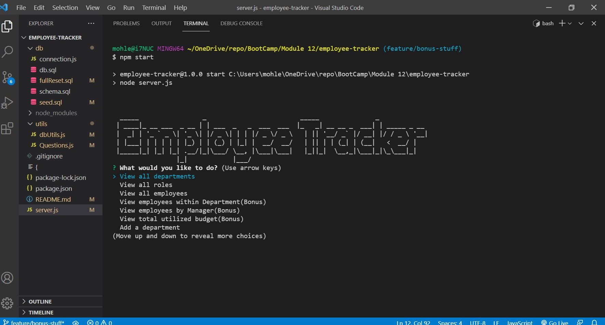

# employee-tracker

## John Mohlenkamp
## June 30, 2021

## GitHub Location: https://github.com/Mohlenkamp/employee-tracker

## GitPages Location: n/a

## Walkthrough Video(s): (using Screencast Free Version / Google Drive)

Part 1: https://drive.google.com/file/d/1VuuPWyNAdFF5X7xKr-jXF85HcTQhJRpC/view  Time 5:00 

Part 2: https://drive.google.com/file/d/1tGPnFTaOc0gOex3cUEOJOjXODbPNCyBB/view  Time 3:28 

## Description 

This is a Node/MySql CLI program to provide a basic contact management system. There are 3 tables (Employee, Role, and Department) that store basic company employee information. The CLI uses Inquirer to provide a menu which allows the user
to perform several functions. In addition to the core functions, listed below are some additional (Bonus) functions that were created as well. There will be one (or more) walkthrough videos that will show the overall flow of the program.

* View all departments
* View all roles
* View all employees
* View employees within Department(Bonus)
* View employees by Manager(Bonus)
* View total utilized budget(Bonus)
* Add a department
* Add a role
* Add an employee
* Update an employee role
* Update an employee manager(Bonus)
* Delete Department(Bonus)
* Delete Role(Bonus)
* Delete Employee(Bonus)

